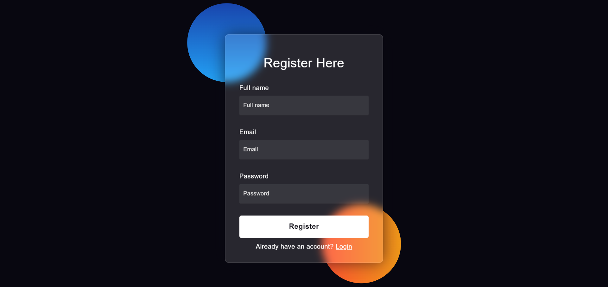
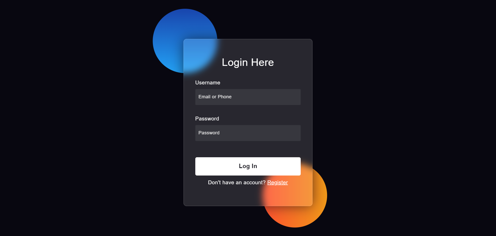
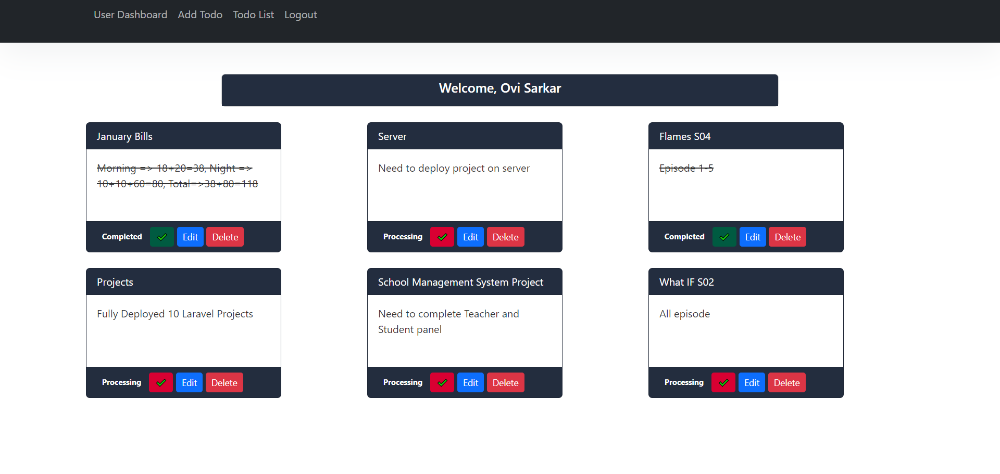

# ToDo Application

The ToDo Application is a simple yet powerful task management tool designed to help users to keep track of their to-do items. It provides a user-friendly interface for creating, editing, and managing tasks.

<em> Visit complete live project [Todo](https://todo-cards.boimelafoundation.com/public/login) </em>

## Contents

- [Project-View](#Project-View)
- [Stack](#stack)
- [Installation](#installation) 
- [Usage](#usage) 

## Project-View

- **Register**

  

  
- **Login**

  

- **Dashboard**

  

## Stack

- MySQL - MySQL database for storing data.
- Laravel - Backend framework for building CRUD Operations.
- PHP - Scripting language.

## Installation

To set up Todo locally, follow these steps:

- Clone the repository:

      git clone https://github.com/OviSarkar62/ToDo-Application.git
      
- Navigate to the project directory:

      cd ToDo-Application

- In the .env file in the root directory set the following environment variables:

      DB_CONNECTION=mysql
      DB_HOST=127.0.0.1
      DB_PORT=3306
      DB_DATABASE=<Database Name>
      DB_USERNAME=<Username>
      DB_PASSWORD=<Password>

- Update the composer: 

      composer update

- Make migration: 

      php artisan migrate
  
- Start the server: 

      php artisan serve
  
- Access the application. Open your web browser and visit http://localhost:8000 to access the ToDo application.

## Usage

- Create a Todo: Click on the "Create New Todo" button to create a new todo.

- Edit and Delete: Edit or delete todos using the respective buttons provided.

- Mark Completed: When a task is completed, you can press mark completed.
